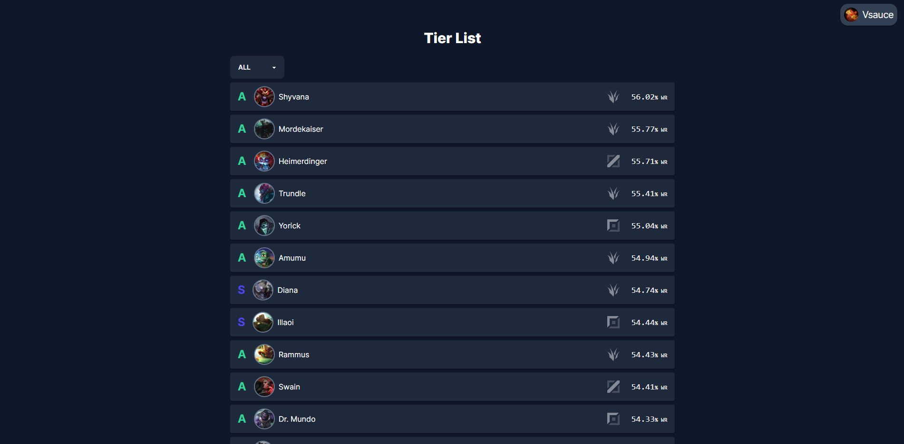
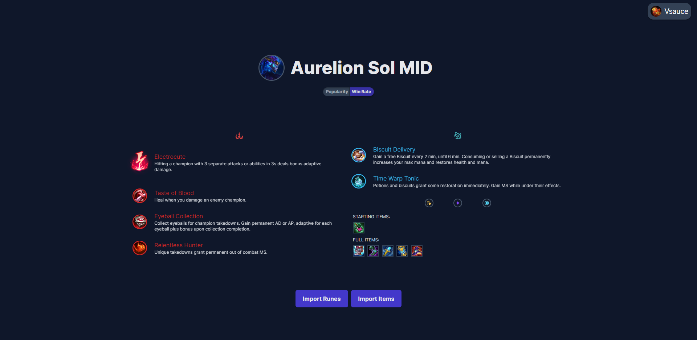

<h1 align="center">⚡ GTools</h1>
A lightweight League of Legends's rune importer with external access from any local device.

### Migration: This repository is being archived in favor of [a new version made up with rust and tauri](https://github.com/euromoon/GTools)

## Build:
 - Install dependencies:
   * bash shell (with `rm`, `mkdir`, `cp` and `zip`)
   * [pnpm](https://pnpm.io/)
   * [golang](https://go.dev/)
 - run make:
    ```
    $ make
    ```

## Screenshots:
<p align="center">
 
 
</p>

## To do:
  - [ ] ~~Check League of Legend's most recent version and download newer resources automatically.~~ (discarted)
  - [X] Connect to the LCU websocket.
  - [X] Implement websocket connection pool.
  - [X] Update the clients on the connection pool when a new change is observed on the LCU.
  - [X] Create the Frontend UI.
  - [X] Add rune importing from ~~U.GG~~ blitz.gg.
  - [X] Show item build.
  - [ ] Add more tabs.
  - [ ] Add cheats (little hacks with the LCU).
  - [ ] Set log to logfile when not in debug mode.
  - [ ] Show tier list when not in champion selection.
  - [ ] Show build even when connected after the game has started.
  - [ ] Consider switching to [fasthttp](https://github.com/valyala/fasthttp).

## Known bugs:
  - [ ] Runes can have mixed-up trees (example with Jayce, manaflow band + treasure hunter).
  - [ ] Connecting to the client after the app is already open makes the app not recieve updates on the lobby endpoint.

## Riot Games: Third Party Applications
https://support-leagueoflegends.riotgames.com/hc/en-us/articles/225266848
